<!-- ╔══════════════════════════════════════════════════════════════════╗ -->
<!-- ║              VARUN ADITYA — GITHUB PROFILE README                ║ -->
<!-- ╚══════════════════════════════════════════════════════════════════╝ -->

<!-- ░░░░░░░░░░░░░░░░  ANIMATED HEADER  ░░░░░░░░░░░░░░░░ -->
<div align="center">

</div>

<br>

<!-- ░░░░░░░░░░░░░░░░  SOCIAL BADGES  ░░░░░░░░░░░░░░░░ -->
<div align="center">

<a href="https://varun-aditya-portfolio.vercel.app">
  
</a>
<a href="https://linkedin.com/in/varunaditya27">
  
</a>
<a href="mailto:varun.paparajugari@gmail.com">
  
</a>
<a href="https://github.com/varunaditya27">
  
</a>


</div>

<!-- ░░░░░░░░░░░░░░░░  ACHIEVEMENT PILLS  ░░░░░░░░░░░░░░░░ -->
<div align="center">
<br>


</div>

<!-- ░░░░░░░░░░░░░░░░  WAVE DIVIDER  ░░░░░░░░░░░░░░░░ -->


<br>

<!-- ░░░░░░░░░░░░░░░░  ABOUT ME  ░░░░░░░░░░░░░░░░ -->
##  &nbsp;Who Am I?


```python
class VarunAditya:
    # ─── Identity ─────────────────────────────────
    institution = "R.V. College of Engineering, Bengaluru"
    program     = "Information Science Engineering  ·  Yr 2 / 4"
    cgpa        = 9.64

    # ─── What I Build ─────────────────────────────
    domains = [
        "🧠  AI/ML Engineering & LLM Pipelines",
        "⚙️   Full-Stack Systems Architecture",
        "📱  Mobile & Edge Intelligence",
        "🤖  Multi-Agent Autonomous Systems",
        "🔗  Blockchain & Decentralised Apps",
        "🖥️   Systems Programming & OS Dev",
    ]

    # ─── Right Now ────────────────────────────────
    active = {
        "building"    : "INDRA · NyayaSetu · Android AI Agent",
        "researching" : "LLM hallucination mitigation, "
                        "context-aware architectures",
        "mentoring"   : "130+ engineers · Web Dev Bootcamp · RVCE",
    }

    # ─── Philosophy ───────────────────────────────
    philosophy = "Build systems that reason. Not tools that respond."

    def current_mission(self):
        return "Architect AI that works at the intersection " \
               "of intelligence, performance, and scale."
```

<br clear="right"/>

<div align="center">
<table>
<tr>
<td align="center" width="200">
<br>
<sub><b>INDRA · NyayaSetu · Android AI Agent</b></sub>
</td>
<td align="center" width="200">
<br>
<sub><b>Mult-Agent Architectures</b></sub>
</td>
<td align="center" width="200">
<br>
<sub><b>130+ Engineers · Coding Club RVCE</b></sub>
</td>
<td align="center" width="200">
<br>
<sub><b>LLM Architectures · Edge AI · Multi-Agent</b></sub>
</td>
</tr>
</table>
</div>

<!-- ░░░░░░░░░░░░░░░░  WAVE DIVIDER  ░░░░░░░░░░░░░░░░ -->


<br>

<!-- ░░░░░░░░░░░░░░░░  TECH STACK  ░░░░░░░░░░░░░░░░ -->
##  &nbsp;Technology Arsenal

<div align="center">

### ⚡ Languages

[](https://skillicons.dev)


---

### 🌐 Frontend & Mobile

[](https://skillicons.dev)


---

### ⚙️ Backend & APIs

[](https://skillicons.dev)


---

### 🧠 AI / ML Ecosystem

[](https://skillicons.dev)


---

### 🗄️ Databases & Storage

[](https://skillicons.dev)


---

### 🔗 Blockchain & Web3


---

### 🚀 DevOps, Cloud & Tools

[](https://skillicons.dev)


---

### 🤖 Embedded & IoT

[](https://skillicons.dev)


</div>

<!-- ░░░░░░░░░░░░░░░░  WAVE DIVIDER  ░░░░░░░░░░░░░░░░ -->


<br>

<!-- ░░░░░░░░░░░░░░░░  FLAGSHIP PROJECTS  ░░░░░░░░░░░░░░░░ -->
##  &nbsp;Flagship Projects

<!-- ─────────────────  PROJECT 1: INDRA  ───────────────── -->
<details open>
<summary><h3>⚡ INDRA — Intelligent Neural Diagnostics & Real-time Advisory</h3></summary>

<div align="left">

> **Real-time power quality intelligence for substation operators — built for Hitachi India R&D.**


**The Problem:** TXpert Hub collects transformer sensor data. Operators wait minutes for analysis, missing intervention windows measured in seconds.

**What I Built:**
- 🔬 **Ensemble ML Core** — 1D CNN learns latent waveform patterns; XGBoost classifies 31 handcrafted features. 60/40 weighted fusion identifies 8 fault classes in **20ms windows**
- 🔩 **Physics Validation Layer** — pandapower digital twin cross-checks every ML prediction against IEEE C57.91 thermal models and IEC 60599 DGA ratios — preventing false alarms
- 🧠 **Waveform Memory (FAISS)** — 64-dim embeddings retrieve top-3 similar historical faults with verified root causes and past operator actions
- 💰 **Real-Time Rupee Counter** — transformer aging, reactive waste, and failure risk quantified live in ₹ so operators understand urgency without reading graphs
- 🏛️ **Compliance Engine** — live IEC 61000-4 + CEA scoring; auto-generates PDF compliance reports when score dips below threshold
- 🖥️ **Premium Control-Room Dashboard** — live waveform canvas, 3-zone incident feed, WebSocket telemetry, oscilloscope view

**My Role:** Team Lead & Full-Stack Developer — owned the complete technical stack from operator dashboard to ML inference backend.

**Impact:** End-to-end latency **200–400ms** from waveform to operator recommendation. One prevented transformer failure (₹15–40 lakh) pays for deployment **50× over**.

<div align="center">

🥈 **2nd Place · VISISONICS AI'26 · MIT Bangalore × Hitachi India R&D Centre**

[](https://github.com/varunaditya27/GridSense-AI)

</div>
</div>
</details>

---

<!-- ─────────────────  PROJECT 2: NyayaSetu  ───────────────── -->
<details>
<summary><h3>⚖️ NyayaSetu — Voice-First Legal Empowerment Platform</h3></summary>

<div align="left">

> **Turning India's 5.39 crore pending court cases into something understandable for people with a Grade 5 education.**


**The Problem:** 80% of Indians are eligible for free legal aid. Almost none receive it. Legal documents are written for lawyers — not the people they affect.

**What I Built:**
- 📱 **Android App (Kotlin + Jetpack Compose)** — CameraX document capture, live clause risk alert cards, scheme entitlement cards, voice input for Kannada and Hindi
- 🎤 **Voice-First Interaction** — full speech input + audio output pipeline with multilingual TTS and STT, making the app usable without literacy
- 🔍 **Document Intelligence Pipeline** — Mistral OCR → Gemma 3 simplification → DistilBERT risk classification → IndicTrans2 translation; each section gets a readability score and retry if above Grade 6
- 📚 **RAG Legal Q&A** — ChromaDB vector store over Indian Kanoon precedents + NALSA schemes; users can ask any question by voice and get a grounded, cited answer
- 📋 **Scheme Matcher** — surfaces BOCW, PMJAY, PM Awas Yojana entitlements based on user profile attributes
- 📡 **eCourts Live Tracking** — direct API integration for real-time case status and order updates

**My Role:** Frontend & Voice Engineer — built the complete Android application, CameraX integration, multilingual voice I/O, and readability enforcement pipeline.

<div align="center">

🏅 **IEEE YESIST12 2026 · 6th Place — India Preliminary Round**

[](https://github.com/varunaditya27/NyayaSetu)

</div>
</div>
</details>

---

<!-- ─────────────────  PROJECT 3: Android AI Agent  ───────────────── -->
<details>
<summary><h3>🤖 Android AI Agent — Natural Language Phone Automation</h3></summary>

<div align="left">

> **Tell your phone what to do. In plain English. The agent figures out the rest.**


**What I Built:**
- 🔄 **ReAct Agent Loop** — Reasoning + Acting loop where the model observes the screen state, plans the next action, executes via ADB, and re-evaluates — until the task is done or a max step limit is reached
- 📸 **Screenshot Intelligence** — Gemini Vision interprets the current screen state in natural language, allowing the agent to understand any app's UI without prior knowledge
- 🌲 **Accessibility Tree Parsing** — ADB dumps the view hierarchy; agent selects the most precise interaction target (by resource ID or bounds) rather than pixel-clicking
- 🔁 **API Key Rotation** — multi-key round-robin pool with cooldown tracking ensures near-zero rate-limit failures for long-running sessions
- 📡 **WebSocket Progress Streaming** — every agent thought, action, and result streamed to client in real-time; frontend shows a live agent log
- ♿ **Accessibility Support** — TalkBack + TTS controls baked in from day one; agent can operate the phone for users who need assistive technology

**My Role:** Sole developer — agent loop architecture, ADB bridge, screenshot pipeline, session management, streaming infrastructure.

<div align="center">

[](https://github.com/varunaditya27/android-ai-agent)

</div>
</div>
</details>

---

<!-- ─────────────────  PROJECT 4: MindForge  ───────────────── -->
<details>
<summary><h3>🧪 MindForge — Real-Time AI Evaluation Platform</h3></summary>

<div align="left">

> **Live AI idea evaluation at scale — built to survive 90+ concurrent users without breaking a sweat.**


**What I Built:**
- 🏋️ **Load-Resilient Architecture** — multi-key API pool with round-robin balancing; fallback scoring kicks in automatically when primary LLM is rate-limited; no user-visible downtime
- 📥 **Priority Queue System** — request queue with priority lanes ensures fairness under peak load; no submission gets lost; latency stays predictable
- ⚡ **Live Evaluation Feed** — WebSocket-driven interface shows real-time scoring, feedback, and leaderboard updates as submissions come in
- 📊 **Analytics Dashboard** — per-participant scoring history, submission timelines, and event-wide leaderboard for coordinators
- 🔒 **Session Management** — JWT-secured evaluation sessions with anti-duplicate-submission guards

**My Role:** Sole developer — designed and shipped the entire platform for RVCE's flagship AI/ML event.

**Impact:** Served **90+ concurrent users** stably during AI Odyssey 2025.

<div align="center">

[](https://github.com/varunaditya27/MindForge)

</div>
</div>
</details>

---

<!-- ─────────────────  PROJECT 5: LearnMate AI  ───────────────── -->
<details>
<summary><h3>🎓 LearnMate AI — Adaptive Learning Intelligence Platform</h3></summary>

<div align="left">

> **Personalized AI tutoring — built and shipped in under 24 hours under competition conditions.**


**What I Built:**
- 🧭 **Adaptive Study Paths** — Gemini decomposes any topic into an optimally sequenced learning tree based on the user's stated goal and prior knowledge level
- 📈 **Progress Intelligence** — tracks completion rates, weak areas, and time-per-concept; resurfaces topics the user is struggling with
- ⚡ **Real-Time Analytics** — Firebase Realtime DB powers live instructor dashboard showing where every student is in the curriculum
- 🗣️ **Conversational Tutoring** — embedded AI tutor that answers follow-up questions with context from the user's current learning path, not generic answers
- 🏆 **Gamified Checkpoints** — quizzes generated per-topic by Gemini; adaptive difficulty based on past performance

**My Role:** Team Lead & Full-Stack Developer — led the team to 1st place in Karnataka and 3rd nationally.

<div align="center">

🥇 **1st Place Karnataka — Rewind & Recode 2025, IIIT Bhubaneswar**

[](https://github.com/varunaditya27/LearnMate-AI)

</div>
</div>
</details>

---

<!-- ─────────────────  PROJECT 6: WalletMind  ───────────────── -->
<details>
<summary><h3>💰 WalletMind — Multi-Agent Autonomous Transaction System</h3></summary>

<div align="left">

> **AI agents that execute financial workflows — every decision logged on-chain before execution.**


**What I Built:**
- 🧩 **4-Agent Orchestration** — Planner decomposes intent → Executor selects transactions → Evaluator validates safety → Communicator reports outcome; all coordinated via LangChain
- 📝 **Decision-First Architecture** — every agent decision is hashed, timestamped, and anchored to the blockchain *before* execution; auditability is a design principle, not a feature
- 🔐 **ERC-4337 Smart Accounts** — Safe SDK-backed programmable wallets with configurable spending limits, emergency pause, and multi-sig support
- 📊 **Live Telemetry Dashboard** — WebSocket-powered real-time agent state, transaction history, and on-chain proof viewer
- 🛡️ **AES-256 Key Management** — private keys encrypted at rest; no plaintext exposure in memory during agent execution
- 🌐 **Multi-Network** — deployed across Ethereum Sepolia, Polygon Amoy, and Base Goerli testnets

**My Role:** Full-Stack Developer — agent pipeline, smart contract integration, blockchain audit logging, live dashboard.

<div align="center">

[](https://github.com/varunaditya27/WalletMind)

</div>
</div>
</details>

---

<!-- ─────────────────  MORE PROJECTS MARQUEE  ───────────────── -->

<div align="center">

### 🗂️ More in the Arsenal

| Project | What It Does | Stack |
|:---|:---|:---|
| **🛡️ AllerSafe** | Allergen detection from food labels via hybrid KG + DistilBERT · **96.7% macro F1** · 4.7s camera-to-result · *IEEE & Scopus Published* | `FastAPI` `Flutter` `spaCy` `DistilBERT` `Supabase` |
| **📚 EduSynth** | Full educational content pipeline: topic → animated video lecture + mind map + PDF + PPTX · *3rd National, Rewind & Recode* | `Next.js` `FastAPI` `Gemini` `ElevenLabs` `Manim` |
| **🛡️ Sentinel Orchestrator** | Decentralised AI-agent threat detection swarm for Cardano DeFi · Masumi + Hydra L2 + Midnight ZK | `Haskell` `Python` `CrewAI` `Cardano` `IPFS` |
| **🔗 NeuraMark** | Blockchain content authentication with semantic fingerprinting · ERC-721 NFT provenance + ChromaDB similarity | `Next.js` `Solidity` `Hardhat` `ChromaDB` `IPFS` |
| **⚙️ NexaKernel** | Bare-metal OS kernel in C + x86 ASM · custom bootloader, paging, round-robin scheduler, VGA driver | `C` `x86 Assembly` `QEMU` `GCC` |
| **👁️ Glimpse3D** | 3D reconstruction from 2D images · SfM, monocular depth CNN, mesh generation, texture mapping | `Python` `PyTorch` `OpenCV` `SfM` |

</div>

<!-- ░░░░░░░░░░░░░░░░  WAVE DIVIDER  ░░░░░░░░░░░░░░░░ -->


<br>

<!-- ░░░░░░░░░░░░░░░░  GITHUB STATS  ░░░░░░░░░░░░░░░░ -->
##  &nbsp;GitHub Telemetry

<div align="center">

<!-- Stats + Streak -->


<br><br>

<!-- Top Languages + Summary Stats -->


<br><br>

<!-- Full Contribution Graph Summary Card -->


<br><br>

<!-- Activity Graph -->


<br><br>

<!-- Trophy Showcase -->


<br><br>

<!-- Contribution Snake -->
<picture>
  <source media="(prefers-color-scheme: dark)" srcset="https://raw.githubusercontent.com/varunaditya27/varunaditya27/output/github-contribution-grid-snake-dark.svg">
  <source media="(prefers-color-scheme: light)" srcset="https://raw.githubusercontent.com/varunaditya27/varunaditya27/output/github-contribution-grid-snake.svg">
  
</picture>

</div>

<!-- ░░░░░░░░░░░░░░░░  WAVE DIVIDER  ░░░░░░░░░░░░░░░░ -->


<br>

<!-- ░░░░░░░░░░░░░░░░  ACHIEVEMENTS  ░░░░░░░░░░░░░░░░ -->
##  &nbsp;Recognition & Achievements

<div align="center">

| 🏆 Achievement | 📍 Venue | 📊 Impact |
|:---|:---|:---|
| **🥈 2nd Place — VISISONICS AI'26** | MIT Bangalore × Hitachi India R&D | 20-hour build · 3-person team · evaluated by Hitachi engineers |
| **🏅 6th Place India — IEEE YESIST12 2026** | International IEEE Student Competition | India Preliminary Round · Frontend & Voice Engineer |
| **📄 Research Publication — NQComp-2026** | IEEE & Scopus Indexed · Manipal Bengaluru | AllerSafe · 96.7% macro F1 · 847-node knowledge graph |
| **🥇 1st Karnataka — Rewind & Recode 2025** | IIIT Bhubaneswar · D³ Tech Fest | LearnMate AI · Team Lead |
| **🥉 3rd National — Rewind & Recode 2025** | National Finals | EduSynth · Full-stack development |
| **🎤 Bootcamp Coordinator** | Coding Club RVCE 2026 | 130+ first-year engineers · 9 sessions · MongoDB track lead |
| **⚡ AI Odyssey 2025 — Event Lead** | RVCE AI/ML Flagship Event | MindForge powered 90+ concurrent users live |

</div>

<!-- ░░░░░░░░░░░░░░░░  WAVE DIVIDER  ░░░░░░░░░░░░░░░░ -->


<br>

<!-- ░░░░░░░░░░░░░░░░  CURRENT FOCUS  ░░░░░░░░░░░░░░░░ -->
##  &nbsp;Current Research Focus

<div align="center">

<table>
<tr>
<td align="center" width="33%">

**🧠 Context-Aware AI**

Designing LLM pipelines that maintain coherent multi-turn state without hallucinating prior context. Applied in INDRA's narration engine and Android AI Agent's ReAct loop.

</td>
<td align="center" width="33%">

**🤝 Multi-Agent Coordination**

Task decomposition, inter-agent trust, and emergent behaviour in LangChain / CrewAI orchestration — INDRA (7-layer pipeline), WalletMind (4-agent system), Sentinel Orchestrator.

</td>
<td align="center" width="33%">

**📱 Edge-First Intelligence**

On-device inference for low-latency, privacy-preserving mobile apps using TFLite + ONNX. NyayaSetu's offline-first legal pipeline is the proving ground.

</td>
</tr>
</table>

</div>

<!-- ░░░░░░░░░░░░░░░░  WAVE DIVIDER  ░░░░░░░░░░░░░░░░ -->


<br>

<!-- ░░░░░░░░░░░░░░░░  CONNECT  ░░░░░░░░░░░░░░░░ -->
##  &nbsp;Let's Build Together

<div align="center">

**Open to:** AI/ML Research · Open-Source · Hackathons · Startups · Systems Programming · Anything ambitious

<br>

<a href="https://varun-aditya-portfolio.vercel.app">
  
</a>
&nbsp;
<a href="https://linkedin.com/in/varunaditya27">
  
</a>
&nbsp;
<a href="mailto:varun.paparajugari@gmail.com">
  
</a>
&nbsp;
<a href="https://github.com/varunaditya27?tab=repositories">
  
</a>

<br><br>

> *"Build systems that reason. Not tools that respond."*

</div>

<!-- ░░░░░░░░░░░░░░░░  FOOTER  ░░░░░░░░░░░░░░░░ -->
<br>

```
$ shutdown --graceful

  · Saving session state...          ✓
  · Flushing memory buffers...       ✓
  · Terminating active processes...  ✓
  · Archiving telemetry logs...      ✓

  Connection terminated.
  System entering standby. █
```

<div align="center">

<sub>
  Engineered by <a href="https://github.com/varunaditya27"><strong>Varun Aditya</strong></a> &nbsp;·&nbsp; Updated June 2026 &nbsp;·&nbsp; RVCE Bengaluru
</sub>
</div>
